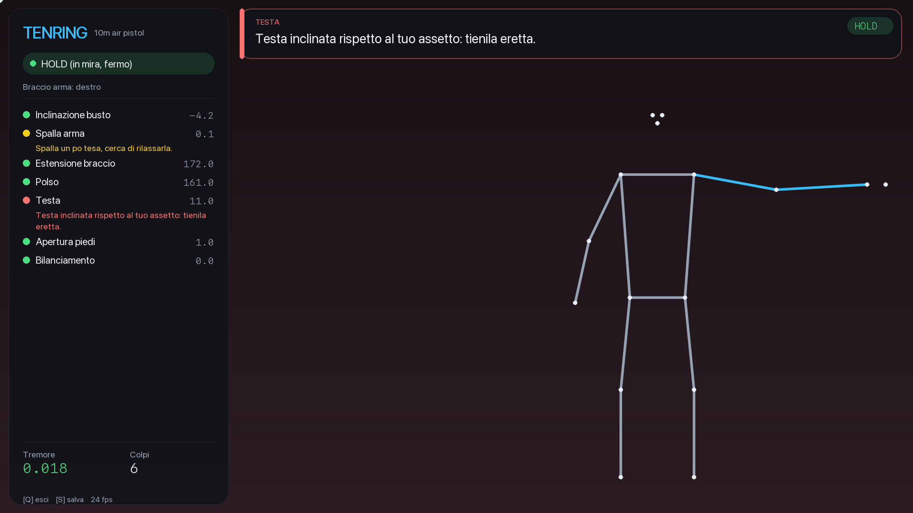
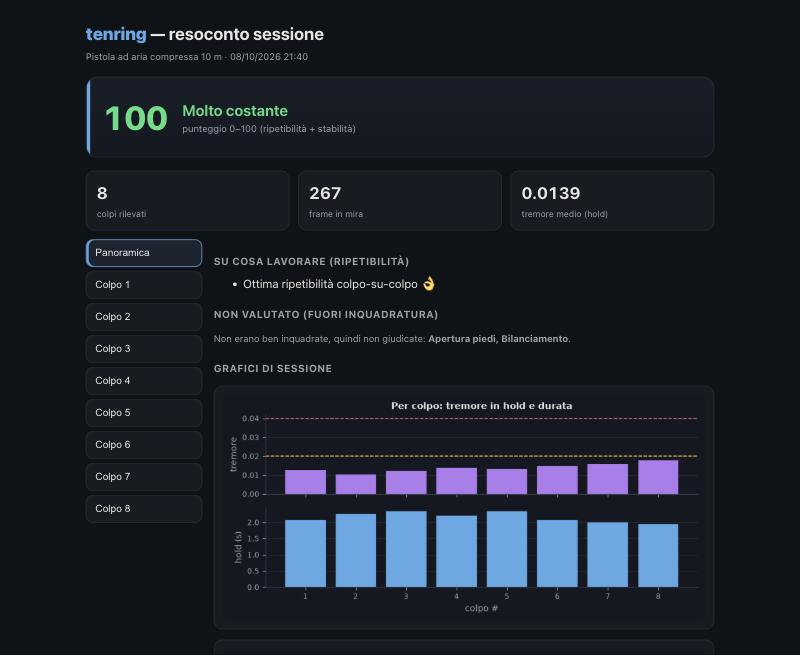
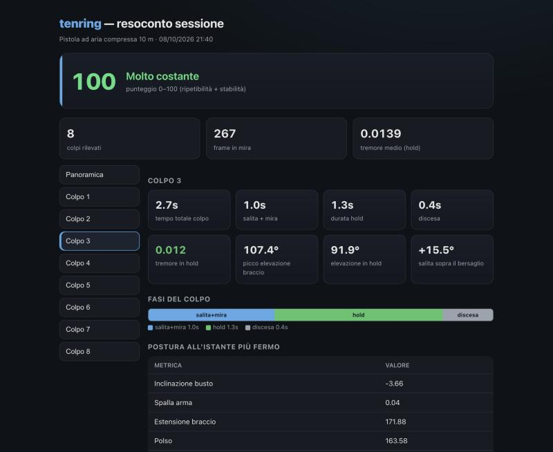

<div align="center">

# 🎯 tenring

**Analisi posturale in tempo reale per il tiro a 10 m con pistola ad aria compressa (ISSF).**

Una webcam, nessuna GPU, feedback live mentre tiri e un resoconto per colpo a fine sessione.



</div>

---

## Cos'è

**tenring** usa la computer vision per guardare il *corpo* del tiratore — non il mirino — e
dire, colpo dopo colpo, dove la postura si allontana dal tuo assetto e quanto sei
**ripetibile**. Perché nel tiro di precisione la bravura non è la posa perfetta di un
singolo colpo: è farla **identica** ogni volta.

- 🧍 **Tracking del corpo** con [MediaPipe BlazePose](https://developers.google.com/mediapipe) (33 keypoint 3D).
- 🟢 **Feedback live** a semaforo: inclinazione busto, spalla, braccio, polso, testa, piedi, bilanciamento, tremore.
- 🔁 **Ciclo di tiro** riconosciuto da solo: *alza il braccio → mira → HOLD → spara → abbassa / ricarica*.
- 📊 **Report per colpo**: tempi di ogni fase, elevazione del braccio, tremore, ripetibilità.
- 💻 Gira in tempo reale su un **MacBook Air M4**, solo CPU/Neural Engine. **Nessuna GPU esterna.**

> **Non sostituisce** [SCATT](https://www.scatt.com/) & co.: quelli tracciano il *mirino*.
> tenring analizza il **corpo**, che è la parte scoperta — e sono complementari.

---

## Screenshot

### HUD live
Pannello sinistro con stato, braccio armato (evidenziato in azzurro) e metriche a semaforo;
banner in alto con la **correzione prioritaria** del momento, leggibile mentre miri.


### Dashboard — panoramica di sessione


### Dashboard — dettaglio per colpo
Clicchi un colpo a sinistra e vedi **tempi di ogni fase** (salita+mira / hold / discesa),
**picco di elevazione** del braccio vs l'assestamento in mira, tremore e postura all'istante
più fermo.



---

## Come funziona

Pipeline per frame, ~real-time:

```
webcam → MediaPipe BlazePose → metriche geometriche → regole (semaforo)
        → macchina a stati del ciclo di tiro → HUD live
                                             → log per-frame → report HTML
```

Tre scelte rendono l'analisi **affidabile** con una sola webcam:

1. **Riconosce il braccio che spara** — quello alzato ed esteso — invece di fidarsi di una
   configurazione fissa (robusto a destrimane/mancino e all'effetto specchio).
2. **Valuta solo ciò che vede** — se i piedi non sono inquadrati, non li giudica (niente
   verdetti inventati).
3. **Riferimento = la *tua* postura di sessione**, non angoli assoluti da manuale: gli angoli
   3D da webcam frontale "derivano" tra sessioni, mentre entro la sessione sei stabilissimo.
   Quindi tenring misura la **deviazione dal tuo assetto** e la **ripetibilità** — le cose
   davvero misurabili e che contano nel tiro.

E riconosce il **ciclo di tiro** con una macchina a stati:

| Stato | Quando | Analizza? |
|---|---|---|
| `IDLE` | corpo non inquadrato | ❌ |
| `READY` | in piedi, braccio giù | ❌ |
| `AIMING` | braccio alzato ed esteso | ✅ |
| `HOLD` | in mira e fermo | ✅ (misura il tremore) |
| `RELEASE` | braccio che scende dopo lo sparo / ricarica | ❌ |

Un **colpo** = salita → hold stabile → discesa. La postura del colpo è catturata
all'**istante più fermo** dell'hold.

---

## Cosa misura (ancorato alla letteratura)

Ogni metrica fa riferimento a un punto di [`docs/THEORY.md`](docs/THEORY.md), basato sulla
manualistica ISSF e sulla biomeccanica del 10 m aria compressa.

| Metrica | Difetto tipico | Rif. |
|---|---|---|
| Inclinazione busto | inclinarsi troppo all'indietro | §2 |
| Spalla arma | spalla alzata/contratta o troppo molle | §3 |
| Estensione braccio | braccio troppo flesso / bloccato | §3 |
| Polso | polso non allineato all'avambraccio | §4 |
| Testa | testa inclinata / ruotata | §5 |
| Apertura piedi | base troppo stretta/larga | §2 |
| Bilanciamento | peso sbilanciato su un piede | §2 |
| Elevazione braccio | quanto sali sopra il bersaglio e come ti assesti (~90°) | §6b |
| Tremore (hold) | oscillazione in fase di mira (piano frontale) | §6 |
| Ripetibilità | varianza colpo-su-colpo | §7 |

---

## Installazione (macOS, Apple Silicon)

```bash
git clone https://github.com/Mic52M/tenring.git
cd tenring

# Ambiente consigliato: Python 3.11/3.12
conda create -n tenring python=3.12 -y
conda activate tenring
pip install -r requirements.txt
pip install -e .
```

Concedi al terminale l'accesso alla fotocamera:
**Impostazioni di sistema → Privacy e sicurezza → Fotocamera**.

> MediaPipe è pinnato a `0.10.21` (la 1.x ha un bug del PoseLandmarker su macOS arm64).
> Il modello `.task` viene scaricato automaticamente al primo avvio.

---

## Uso

Avvio rapido (attiva l'env e parte a schermo intero):

```bash
./run.sh
```

Calibrazione personale (opzionale, una volta — mettiti in posizione di tiro, braccio su):

```bash
./calibra.sh
```

Oppure, con l'env `tenring` attivo:

```bash
tenring                 # finestra
tenring --fullscreen    # schermo intero
tenring --list-cameras  # scegli la webcam giusta (salta l'iPhone/Continuity)
```

**Comandi a schermo:** `Q` esci · `S` salva un report al volo.
A fine sessione si apre da solo il report HTML (in `sessions/`), con `.jsonl` grezzo e `.txt`.

| Opzione | Effetto |
|---|---|
| `--camera N` | forza una webcam specifica |
| `--fullscreen` | schermo intero, niente bande nere |
| `--no-mirror` | disattiva l'effetto specchio (per camera di profilo) |
| `--width 1280 --height 720` | più fps a scapito della nitidezza |
| `--complexity {0,1,2}` | modello pose: 0 veloce … 2 preciso |

Setup consigliato per l'MVP: **webcam a sinistra**, inquadratura piena **dai piedi alla testa**.

---

## Architettura

```
src/tenring/
  pose/        backend pose estimation astratto (+ MediaPipe BlazePose)
  analysis/    geometry · metrics · rules · state (ciclo di tiro) ·
               arm (rilevamento braccio) · baseline (riferimento di sessione) ·
               session · recorder
  ui/          overlay.py  — HUD live (Pillow, font San Francisco)
  report/      html_report.py — report interattivo per colpo
  app.py       loop live    ·    calibrate.py  calibrazione personale
config/
  reference.yaml   soglie ancorate alla teoria (§ in docs/THEORY.md)
  profile.yaml     (generato) il tuo neutro calibrato
docs/THEORY.md     base tecnica del tiro a 10 m
```

Il backend di pose è dietro un'interfaccia astratta: si può sostituire MediaPipe con
**RTMPose / YOLO-pose / ViTPose** senza toccare l'analisi.

---

## Limiti (onesti)

- **Una sola camera** → ottima sul piano che inquadra; la quadratura spalle / rotazione busto
  e il tremore in profondità richiedono una seconda camera (fase 2).
- **Non misura la mira/mirino** né lo scatto del grilletto: è il dominio dei sistemi ottici (SCATT).
- Gli **angoli assoluti** da webcam non sono affidabili tra sessioni → si valuta la deviazione
  dal proprio assetto e la ripetibilità (vedi *Come funziona*).

---

## Roadmap

- [ ] Audio dello scatto per conteggio esatto dei colpi e distinzione colpo/ricarica.
- [ ] Coach in linguaggio naturale (LLM) sul report, a partire dalle metriche.
- [ ] Seconda camera (fase 2) per quadratura spalle e tremore 3D.
- [ ] Trend tra sessioni (dai `.jsonl` già salvati).

---

## Test

```bash
pip install pytest && pytest
```

## Licenza

MIT.

---

<div align="center">
<sub>Progetto personale di allenamento. Non è un dispositivo di misura certificato.</sub>
</div>
